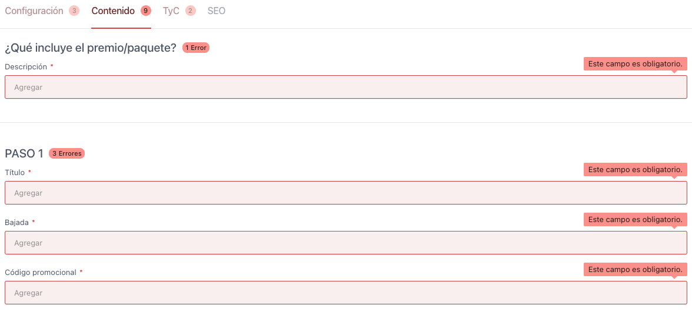
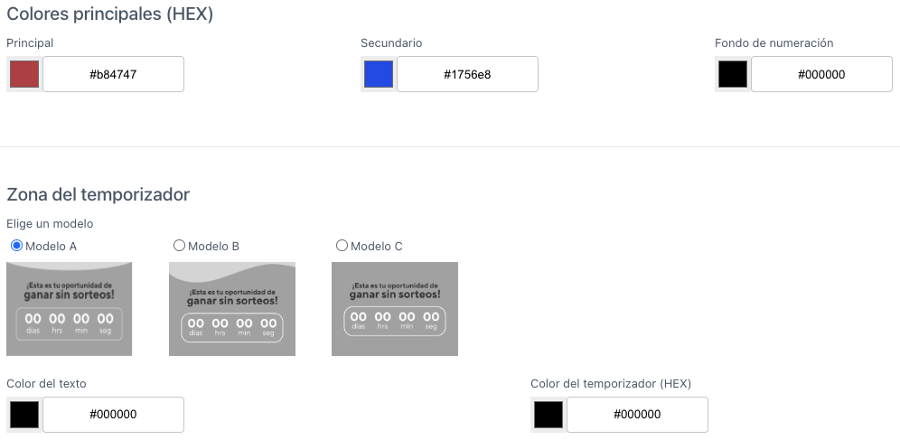

- **Nombre de campaña (\*):** Título interno para identificar la promoción dentro del CMS. Se debe colocar este campo de manera obligatoria porque sino no se podrá Previsualizar la landing creada.

- **Identificador de Promoción (Tag Manager) (\*):** Código que se conecta con herramientas de analítica como GTM. Ejemplo: `popeyes, cine, gasolina, donas, etc.`

- **URL para producción:** Enlace final donde se publicará la landing promocional.

> ⚠️ **OBS:** **(\*)** Indica que el campo es obligatorio. Si no se completa, el CMS mostrará un mensaje de advertencia y no permitirá publicar cambios hasta que se ingrese la información requerida. Por ejemplo:

Veamos otros errores de campos sin completar:

---

Visualicemos otros campos:

- **Mundo al que pertenece la landing (\*):** Define el entorno de la promoción. Puede ser _Casino Atlantic City_, _Casino_ o _Sports_. Según la opción seleccionada, se ajustarán automáticamente el logo del encabezado, el color del botón principal y el diseño del pie de página.

- **Banners (key visual):** Este campo permite subir imágenes clave para la promoción en dos formatos: **desktop** y **mobile**, ya sea seleccionándolas desde la biblioteca o ingresando sus URLs.

---

- **Colores principales (\*):** Permite seleccionar los colores que irán en diferentes partes de los contenedores en toda la landing, tenemos colores como:

  | Color               | Descripción                                                         | Valor      |
  | ------------------- | ------------------------------------------------------------------- | ---------- |
  | Primario            | Aplica al contenedor de los pasos para participar en la promoción.  | `#47c260 ` |
  | Secundario          | Aplica al fondo del contenedor del temporizador.                    | `#3680ce ` |
  | Fondo de numeración | Aplica detrás de los pasos numerados u otros componentes similares. | `#21af0e ` |

- **Modelo de Temporizador (\*):** Permite seleccionar uno de los tres estilos disponibles para mostrar el temporizador en la landing.

- **Color temporizador:** Campo en formato HEX que define el color del borde y los números del temporizador. Ejemplo: `#47c260 `

- **Color del texto (\*):** Determina el color del texto que acompaña al temporizador, como etiquetas o títulos relacionados.
