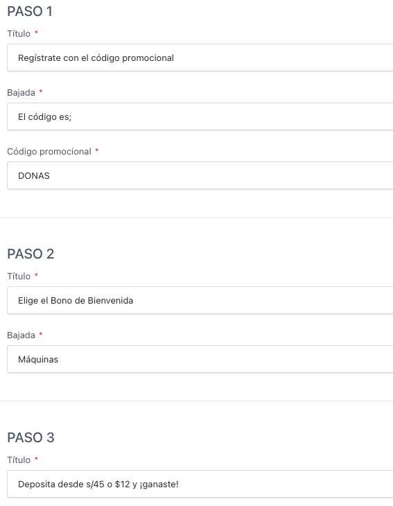

- **¿Qué incluye el premio/paquete? (\*):** Este campo describe claramente los beneficios o elementos que forman parte del premio ofrecido en la promoción.

---

- **Pasos para participar en la promoción (\*):** Se deben ingresar tres pasos, cada uno compuesto por un **título** y una **descripción** (también llamada _bajada_), ambos obligatorios, que expliquen la acción a realizar. El **Paso 1** incluye adicionalmente un campo obligatorio para ingresar el **Código de Promoción**, el cual será visible para el usuario en la landing.

> ⚠️ **OBS:** (\*) Indica que el campo es obligatorio.

> ❌ 3 errores: Indica que hay tres campos obligatorios pendientes por completar en esta sección.

---

- **Botón principal (\*):** Se deben ingresar el texto del botón y la ruta donde se desea dirigir al usuario al hacer clic.
