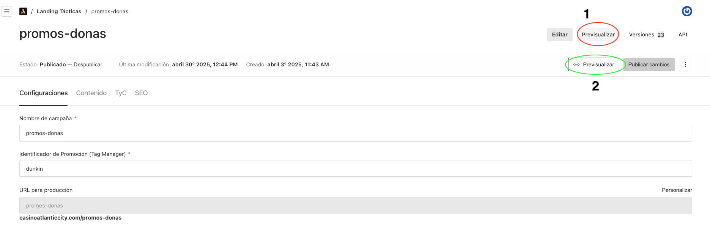
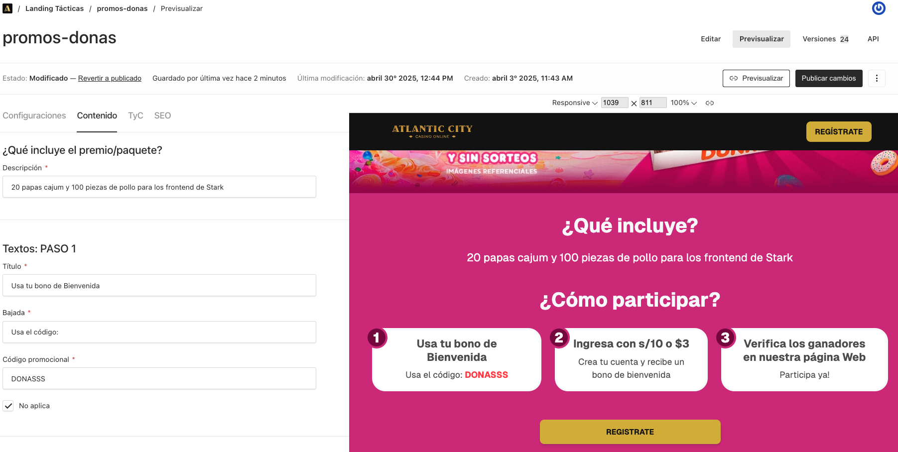
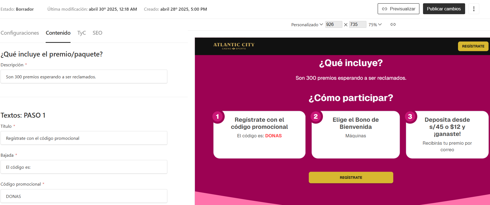

Por defecto se muestra la vista de esta manera:

Contamos con dos opciones para previsualizar. La **opción 1** permite abrir un visualizador que muestra como va quedando la landing táctica con la información completada hasta el momento. A medida que se modifican los campos, la landing se actualiza en tiempo real, como se muestra a continuación:

Segundo momento, podemos observar que los campos al ser completados cambian en tiempo real:

