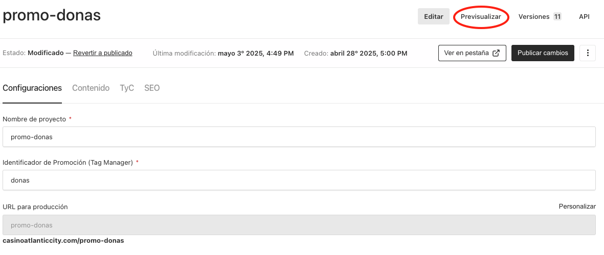

Por defecto se muestra la vista de esta manera:

Contamos con la opción de **Previsualizar**. Esta nos permite abrir un visualizador que muestra como va quedando la landing táctica con la información completada hasta el momento. A medida que se modifican los campos, la landing se actualiza en tiempo real, como se muestra a continuación:

<video src="/images/Changes-in-real-time.mp4" class="video" autoplay muted loop controls>
  Tu navegador no soporta el video.
</video>

También podemos notar que el **Previsualizar** tiene ciertos detalles:

<video src="/images/Detalles-del-Previsualizador.mp4" class="video" autoplay muted loop controls>
  Tu navegador no soporta el video.
</video>

Observamos que hay valores como:

**📱 Mobile:** Vista simulada para dispositivos móviles. El Previsualizador ajusta el contenido a un ancho típico de smartphone.

**📲 Tablet:** Vista optimizada para tablets. Permite ver cómo se adapta el contenido a pantallas intermedias.

**💻 Desktop:** Vista para computadoras de escritorio o laptops. Representa un entorno de pantalla ancha convencional.

**Responsive:** El Previsualizador adapta automáticamente el contenido al cambiar el tamaño del navegador, mostrando cómo responde el diseño a diferentes dimensiones.

**🔢 978**: Ancho del Previsualizar en píxeles (px).

**📐 801**: Altura del Previsualizador en píxeles (px).

**100%**: Porcentaje de visualización del Previsualizador. Puede tomar diferentes valores, se recomienda trabajar con **100%** o **Responsive**.

---
