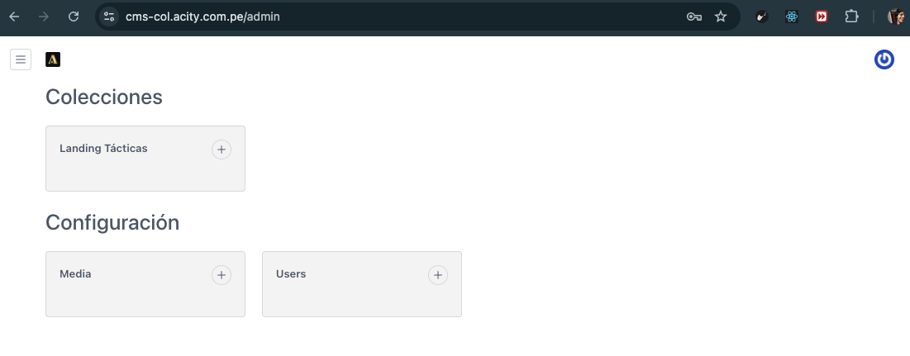
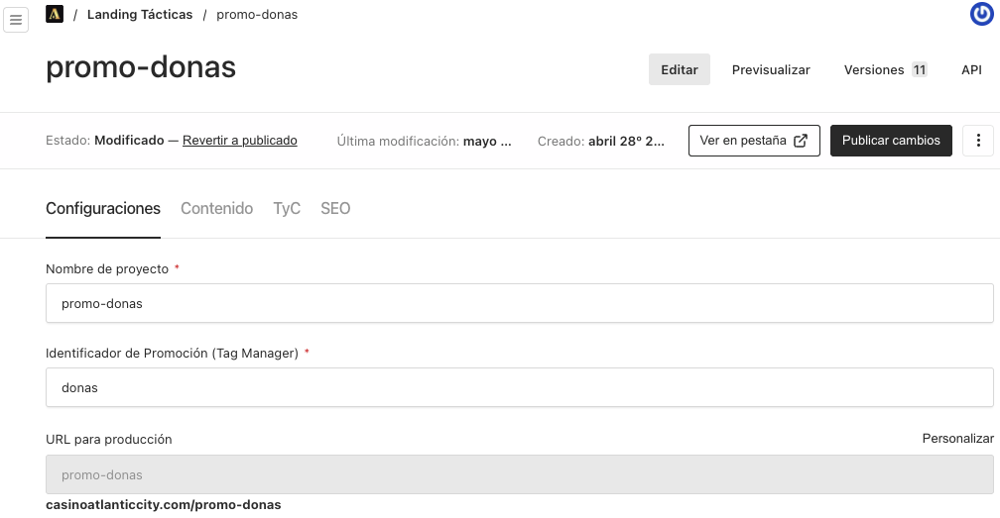
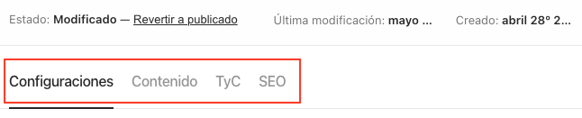
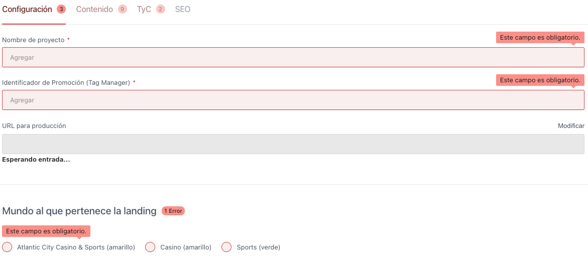
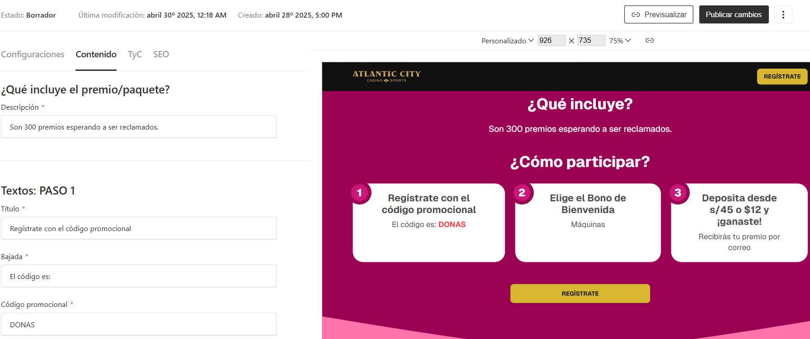
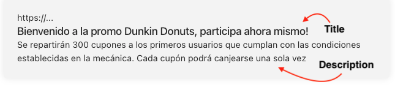
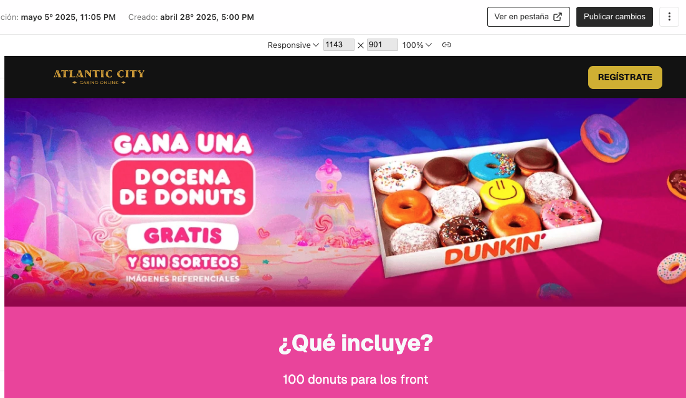
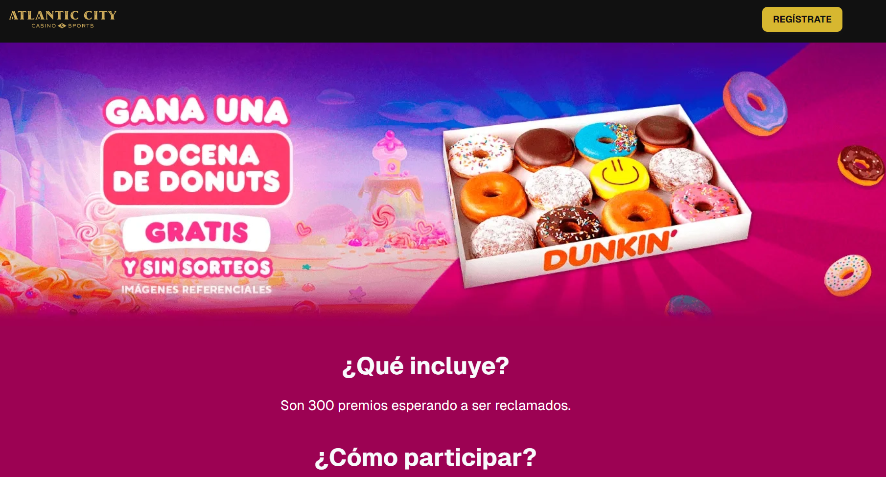
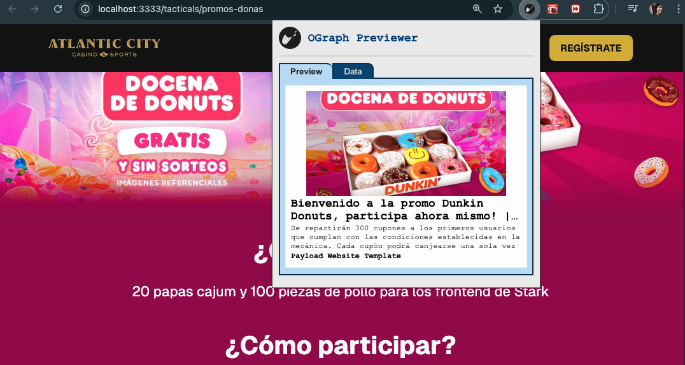

# 1. Introducción:

Bienvenido al CMS de Landing Tácticas. Esta plataforma permite crear, editar y administrar contenidos promocionales que se generan en formato JSON para su uso en diferentes landing tácticas que pueden ser empleadas por el equipo de **Marketing** y **Negocio**.

El CMS ha sido desarrollado utilizando [Payload CMS](https://payloadcms.com/), una plataforma moderna de código abierto que permite construir sistemas de gestión de contenido altamente personalizados de manera flexible y segura, sin necesidad de conocimientos técnicos avanzados por parte del usuario final.

**¿Cuál es el propósito de este CMS?**
Su objetivo principal es facilitar la generación automática de un archivo JSON que contiene toda la información de una landing táctica: títulos, textos promocionales, pasos para participar, colores de marca y estilos visuales.

Todas las landings comparten un mismo diseño base, y solo cambia la información, **elementos visuales** (como logos, portadas y colores), los cuales son configurados directamente en el CMS sin necesidad de intervención técnica, reduciendo tiempos y errores.

Este manual explica cómo usar el CMS correctamente, detallando cada campo que debe completarse para crear nuevas promociones de forma eficiente y ordenada.

# 2. Acceso al CMS:

- **URL de acceso**: https://cms-dx.acity.com.pe/admin/login

- **Credenciales**:

  - Correo electrónico: proporcionado por el administrador (Ejemplo: `admin@acity.com.pe`)

  - Contraseña: proporcionada por el administrador (Ejemplo: `12345`)

- **Recomendación**: Usar Google Chrome para una mejor compatibilidad.

**Pantalla de login**:


En esta pantalla deberás ingresar tu correo electrónico y contraseña asignada. También encontrarás un enlace para recuperar tu contraseña en caso la hayas olvidado, y un botón para **iniciar sesión**. Asegúrate de que los datos ingresados sean correctos para acceder al panel principal del CMS.

# 3. Pantalla Principal del CMS:

Una vez que inicias sesión, verás el **Dashboard principal**, donde se muestran las principales secciones del CMS:



- **Landing Tácticas**:
  Es la colección donde se crean, editan y administran las promociones. Cada entrada genera un JSON con los datos configurados, que se usarán en la landing correspondiente.

- **Configuración**:
  Contiene submódulos como:

  - **Media**: para subir y administrar imágenes (como logos, portadas o banners).

  - **Users**: gestión de los usuarios que tienen acceso al CMS.

Desde este panel puedes navegar fácilmente entre las secciones y comenzar a trabajar en las campañas promocionales.

# 4. Crear una Nueva Promoción:

1. **Antes de crear una nueva landing**, asegúrate de revisar las recomendaciones ubicadas en la parte superior de la tabla de promociones. Estas contienen requisitos importantes que debes tener a la mano para completar correctamente la configuración de la campaña.

2. Presionar el botón **“Crear Nuevo”** ubicado en la parte superior derecha.

En esta vista también encontrarás una tabla resumen de las landings creadas con las siguientes columnas:

- **Nombre de proyecto**
- **URL para producción**
- **Fecha de modificación**


3.  Al darle **Crear Nuevo** se visualizará los siguientes campos:



---

Observamos los siguientes campos:


---

Observaremos los colores principales y modelos del Temporizador (Brindados por UI).


---

Tenemos las siguientes opciones:


4. Entrando a detalle a la siguiente vista, tenemos:



Donde contamos con 4 Tabs que a su vez contiene los siguientes campos:

- **Configuraciones**:

  - Nombre de campaña
  - Identificador de Promoción (Tag Manager)
  - URL para producción
  - Mundo al que pertenece la landing (casino atlantic city, casino, sports)
  - Banners (key visual)
  - Colores principales (Hexadecimal)
  - Temporizador (modelo, color de fondo, color de texto)

- **Contenido**:

  - ¿Qué incluye el premio/paquete? (Descripción)
  - Pasos para participar en la promoción
  - Botón principal (Texto y donde te lleva)

- **TyC (Términos y Condiciones)**:

  - Vigencia (Fecha de inicio y fin)
  - Mecánica
  - Premio

- **SEO (Optimización para Motores de Búsqueda)**:
  - Título
  - Meta Image
  - Descripción

# 5. Campos de los Tabs del CMS:

## 5.1 Tab Configuraciones:


- **Nombre de campaña <span style='color:red'>(\*)</span>:** Título interno para identificar la promoción dentro del CMS. Se debe colocar este campo de manera obligatoria porque sino no se podrá Previsualizar la landing creada.

- **Identificador de Promoción (Tag Manager) <span style='color:red'>(\*)</span>:** Código que se conecta con herramientas de analítica como GTM. Ejemplo: `popeyes, cine, gasolina, donas, etc.`

- **URL para producción:** Enlace final donde se publicará la landing promocional.

> ⚠️ **OBS:** **<span style='color:red'>(\*)</span>** Indica que el campo es obligatorio. Si no se completa, el CMS mostrará un mensaje de advertencia y no permitirá publicar cambios hasta que se ingrese la información requerida. Por ejemplo:



Veamos otros errores de campos sin completar:


---

Visualicemos otros campos:


- **Mundo al que pertenece la landing <span style='color:red'>(\*)</span>:** Define el entorno de la promoción. Puede ser _Casino Atlantic City_, _Casino_ o _Sports_. Según la opción seleccionada, se ajustarán automáticamente el logo del encabezado, el color del botón principal y el diseño del pie de página.

- **Banners (key visual):** Este campo permite subir imágenes clave para la promoción en dos formatos: **desktop** y **mobile**, ya sea seleccionándolas desde la biblioteca o ingresando sus URLs.

---


- **Colores principales <span style='color:red'>(\*)</span>:** Permite seleccionar los colores que irán en diferentes partes de los contenedores en toda la landing, tenemos colores como:

  | Color               | Descripción                                                         | Valor      |
  | ------------------- | ------------------------------------------------------------------- | ---------- |
  | Primario            | Aplica al contenedor de los pasos para participar en la promoción.  | `#47c260 ` |
  | Secundario          | Aplica al fondo del contenedor del temporizador.                    | `#3680ce ` |
  | Fondo de numeración | Aplica detrás de los pasos numerados u otros componentes similares. | `#21af0e ` |

- **Modelo de Temporizador <span style='color:red'>(\*)</span>:** Permite seleccionar uno de los tres estilos disponibles para mostrar el temporizador en la landing.

- **Color temporizador:** Campo en formato HEX que define el color del borde y los números del temporizador. Ejemplo: `#47c260 `

- **Color del texto <span style='color:red'>(\*)</span>:** Determina el color del texto que acompaña al temporizador, como etiquetas o títulos relacionados.

## 5.2 Tab Contenido:


- **¿Qué incluye el premio/paquete? <span style='color:red'>(\*)</span>:** Este campo describe claramente los beneficios o elementos que forman parte del premio ofrecido en la promoción.

---


- **Pasos para participar en la promoción <span style='color:red'>(\*)</span>:** Se deben ingresar tres pasos, cada uno compuesto por un **título** y una **descripción** (también llamada _bajada_), ambos obligatorios, que expliquen la acción a realizar. El **Paso 1** incluye adicionalmente un campo obligatorio para ingresar el **Código de Promoción**, el cual será visible para el usuario en la landing.

> ⚠️ **OBS:** <span style='color:red'>(\*)</span> Indica que el campo es obligatorio.


> ❌ 3 errores: Indica que hay tres campos obligatorios pendientes por completar en esta sección.

---


- **Botón principal <span style='color:red'>(\*)</span>:** Se deben ingresar el texto del botón y la ruta donde se desea dirigir al usuario al hacer clic.

## Opción de Previsualizar:

Por defecto se muestra la vista de esta manera:


Contamos con dos opciones para previsualizar. La **opción 1** permite abrir un visualizador que muestra como va quedando la landing táctica con la información completada hasta el momento. A medida que se modifican los campos, la landing se actualiza en tiempo real, como se muestra a continuación:


SEO

---

Segundo momento, podemos observar que los campos al ser completados cambian en tiempo real:



La segunda opción de **Previsualización** abre una nueva pestaña con la versión actual de la landing táctica, mostrando la información registrada en los campos, así como los colores e imágenes configurados. A continuación se visualiza así:

## 5.3 Tab TyC (Términos y Condiciones):


- **Vigencia:** Permite definir el período de duración de la promoción mediante dos campos de fecha: **Inicio y Fin <span style='color:red'>(\*)</span>**. Esta información se mostrará dentro de la sección de Términos y Condiciones. **Estos campos son obligatorios.**


- **Mecánica:** Describe detalladamente los pasos que debe seguir el usuario para participar. Puedes incluir títulos, subtítulos, párrafos de texto y listas numeradas o con viñetas.

- **Premio:** Detalla lo que recibirán los participantes que cumplan con las condiciones. Incluye cantidad de premios, condiciones de uso, vigencia del cupón y cualquier otra restricción relevante. También puedes incluir títulos, subtítulos, párrafos de texto y listas numeradas o con viñetas.

## 5.4 SEO (Optimización para motores de búsqueda):


- **Title:** Campo destinado a establecer un título claro y conciso que resuma el contenido principal de la promoción. Este texto será utilizado por los motores de búsqueda (como Google) para mostrar el nombre de la página en los resultados. Se recomienda no superar los 60 caracteres. **Ejemplo de uso:** `Bienvenido a la promo Dunkin Donuts, participa ahora mismo!`

- **Meta Image:** Imagen representativa de la promoción que se muestra cuando el enlace es compartido en redes sociales o aplicaciones de mensajería (como WhatsApp o Facebook). La imagen debe captar la atención y estar relacionada con la temática de la promoción. **Recomendación:** Usar imágenes en formato horizontal (ej. 1200x630 px), con poco texto y de buena calidad. **Ejemplo de uso:** `Se repartirán 300 cupones a los primeros usuarios que cumplan con las condiciones establecidas en la mecánica. Cada cupón podrá canjearse una sola vez`

- **Description:** Resumen breve del contenido de la promoción que será visible en los resultados de búsqueda. Sirve para informar y atraer al usuario. Debe incluir los aspectos clave como premios, condiciones y fechas. El texto no debe exceder los 200 caracteres para evitar cortes en los buscadores.

  _Al completar correctamente los campos del SEO, podremos visualizar que funciona correctamente de las siguientes maneras:_

- **En el mismo CMS:**



- **Abriendo en Previsualizar**

  Damos clic en **Previsualizar** donde se abrirá otra pestaña donde se podrá visualizar la landing con los datos completos.



Podremos visualizar la landing de la siguiente manera:



Realizaremos los siguientes pasos con la landing que visualizamos en una nueva pestaña.

- 1. Clic derecho
- 2. Inspeccionar
- 3. Seleccionan Elementos:
- 4. `Ctrl o Cmd + f` y escriben **description**, les mostará:


Observaremos que se muestra los valores de los campos title y description que se agregaron en el CMS:


Usando una extensión "OGraph Previewer 2.0.0"

- 1. Activamos la extensión
- 2. Clic al icono de la extensión y observaremos que se registró correctamente los campos (Title, Image, Description):



# 6. JSON obtenido por el CMS:

Una vez que se hayan completado correctamente los campos en el CMS, se generará un JSON, que es una estructura de datos que luego será utilizada en el frontend para construir la maqueta de la landing táctica según lo que el usuario desee.

¿Cómo se mandan los valores ingresados al JSON?


1. Tenemos que dar clic en **Publicar cambios** para guardar los datos correctamente.
2. Para poder visualizar el JSON, damos clic en "API".


3. El resultado será:

```json

{

  {
  "id": 1,
  "title": "promos-popeyes",
  "identifier": "pollitos",
  "slug": "promos-popeyes",
  "slugLock": true,
  "world": {
    "group": "casino"
  },
  "keyVisual": {
    "heroImage": {
      "id": 1,
      "alt": "image-promo",
      "url": "/api/media/file/hero-banner-desktop.png",
      "width": 1440,
      "height": 440,
      "sizes": {
        "thumbnail": {
          "url": "/api/media/file/hero-banner-desktop-300x92.png",
          "width": 300,
          "height": 92
        },
        "square": {
          "url": "/api/media/file/hero-banner-desktop-500x500.png",
          "width": 500,
          "height": 500
        },
        "small": {
          "url": "/api/media/file/hero-banner-desktop-600x183.png",
          "width": 600,
          "height": 183
        },
        "medium": {
          "url": "/api/media/file/hero-banner-desktop-900x275.png",
          "width": 900,
          "height": 275
        },
        "large": {
          "url": "/api/media/file/hero-banner-desktop-1400x428.png",
          "width": 1400,
          "height": 428
        },
        "og": {
          "url": "/api/media/file/hero-banner-desktop-1200x630.png",
          "width": 1200,
          "height": 630
        }
      }
    },
    "heroImageMobile": {
      "id": 2,
      "alt": "image-promo",
      "url": "/api/media/file/hero-banner-mobile.png",
      "width": 720,
      "height": 880,
      "sizes": {
        "thumbnail": {
          "url": "/api/media/file/hero-banner-mobile-300x367.png",
          "width": 300,
          "height": 367
        },
        "square": {
          "url": "/api/media/file/hero-banner-mobile-500x500.png",
          "width": 500,
          "height": 500
        },
        "small": {
          "url": "/api/media/file/hero-banner-mobile-600x733.png",
          "width": 600,
          "height": 733
        },
        "og": {
          "url": "/api/media/file/hero-banner-mobile-1200x630.png",
          "width": 1200,
          "height": 630
        }
      }
    }
  },
  "maincolors": {
    "primary": "#fd8b21",
    "secondary": "#000",
    "background": "#000",
    "borderColor": "#e5ac76"
  },
  "countdown": {
    "model": "B",
    "color": "#a9dfea",
    "text-color": "negro"
  },
  "included": {
    "description": "20 papas cajum y 100 piezas de pollo para los frontend de Stark"
  },
  "step-1": {
    "title": "Participa en la promo",
    "sub": "Usa el código:",
    "code": "POPEYASO",
    "has-code": true
  },
  "step-2": {
    "title": "Ingresa con s/10 o $3",
    "sub": "Crea tu cuenta y recibe un bono de bienvenida"
  },
  "step-3": {
    "title": "Verifica los ganadores en nuestra página Web",
    "sub": "Participa ya!"
  },
  "mainbutton": {
    "text": "REGISTRATE",
    "target": "registro"
  },
  "counttext": {
    "description": "hola"
  },
  "validity": {
    "start": "2025-04-03T05:00:00.000Z",
    "end": "2025-04-17T05:00:00.000Z"
  },
  "mechanic": {
    "root": {
      "children": [
        {
          "type": "paragraph",
          "children": [
            {
              "text": "Agregando texto para la mecanica de la promo Popeyasoooo"
            }
          ]
        },
        {
          "type": "paragraph",
          "children": []
        },
        {
          "type": "paragraph",
          "children": [
            {
              "text": "Aua"
            }
          ]
        }
      ]
    }
  },
  "prize": {
    "root": {
      "children": [
        {
          "type": "paragraph",
          "children": [
            {
              "text": "Los premios se repartirán a los primeros que cumplan con las condiciones..."
            }
          ]
        },
        {
          "type": "paragraph",
          "children": [
            {
              "text": "1. Se repartirán 300 cupones..."
            }
          ]
        },
        {
          "type": "paragraph",
          "children": [
            {
              "text": "2. Los cupones tienen una validez de 4 meses..."
            }
          ]
        },
        {
          "type": "paragraph",
          "children": [
            {
              "text": "3. No se permiten devoluciones..."
            }
          ]
        },
        {
          "type": "paragraph",
          "children": [
            {
              "text": "4. El cupón se entrega al “ganador”..."
            }
          ]
        },
        {
          "type": "paragraph",
          "children": [
            {
              "text": "Las imágenes de los productos son referenciales."
            }
          ]
        },
        {
          "type": "paragraph",
          "children": [
            {
              "text": "Los cupones son válidos para consumo en salón..."
            }
          ]
        }
      ]
    }
  },
  "meta": {
    "title": null,
    "image": null,
    "description": null
  },
  "updatedAt": "2025-04-08T03:38:36.630Z",
  "createdAt": "2025-04-03T16:43:13.588Z",
  "_status": "published"
}


}

```

Y de esta manera tenemos todos los datos registrados correctamente!

# Conclusión

Esperamos que este manual te haya ayudado a comprender el funcionamiento del CMS y a aprovechar al máximo sus funcionalidades. Completar correctamente los campos y seguir las buenas prácticas descritas aquí te permitirá generar contenido eficiente y coherente para tus proyectos. Si tienes dudas o necesitas soporte adicional, no dudes en ponerte en contacto con el equipo correspondiente (célula Stark).

Gracias por utilizar nuestro CMS. ¡Éxitos en la creación de tus contenidos!
