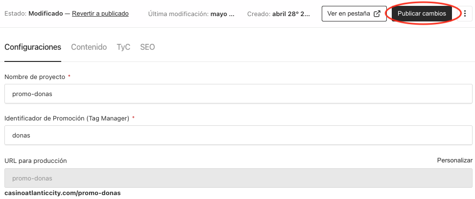

Una vez que se hayan completado correctamente los campos en el CMS, se generará un JSON, que es una estructura de datos que luego será utilizada en el frontend para construir la maqueta de la landing táctica según lo que el usuario desee.

¿Cómo se mandan los valores ingresados al JSON?



1. Tenemos que dar clic en **Publicar cambios** para guardar los datos correctamente.
2. Para poder visualizar el JSON, damos clic en "API".


<li class='list-none'><p>3. El resultado será:</p></li>

<div class="json-block">
```json
{
  "id": 1,
  "title": "promos-popeyes",
  "identifier": "pollitos",
  "slug": "promos-popeyes",
  "slugLock": true,
  "world": {
    "group": "casino"
  },
  "keyVisual": {
    "heroImage": {
      "id": 1,
      "alt": "image-promo",
      "url": "/api/media/file/hero-banner-desktop.png",
      "width": 1440,
      "height": 440,
      "sizes": {
        "thumbnail": {
          "url": "/api/media/file/hero-banner-desktop-300x92.png",
          "width": 300,
          "height": 92
        },
        "square": {
          "url": "/api/media/file/hero-banner-desktop-500x500.png",
          "width": 500,
          "height": 500
        },
        "small": {
          "url": "/api/media/file/hero-banner-desktop-600x183.png",
          "width": 600,
          "height": 183
        },
        "medium": {
          "url": "/api/media/file/hero-banner-desktop-900x275.png",
          "width": 900,
          "height": 275
        },
        "large": {
          "url": "/api/media/file/hero-banner-desktop-1400x428.png",
          "width": 1400,
          "height": 428
        },
        "og": {
          "url": "/api/media/file/hero-banner-desktop-1200x630.png",
          "width": 1200,
          "height": 630
        }
      }
    },
    "heroImageMobile": {
      "id": 2,
      "alt": "image-promo",
      "url": "/api/media/file/hero-banner-mobile.png",
      "width": 720,
      "height": 880,
      "sizes": {
        "thumbnail": {
          "url": "/api/media/file/hero-banner-mobile-300x367.png",
          "width": 300,
          "height": 367
        },
        "square": {
          "url": "/api/media/file/hero-banner-mobile-500x500.png",
          "width": 500,
          "height": 500
        },
        "small": {
          "url": "/api/media/file/hero-banner-mobile-600x733.png",
          "width": 600,
          "height": 733
        },
        "og": {
          "url": "/api/media/file/hero-banner-mobile-1200x630.png",
          "width": 1200,
          "height": 630
        }
      }
    }
  },
  "maincolors": {
    "primary": "#fd8b21",
    "secondary": "#000",
    "background": "#000",
    "borderColor": "#e5ac76"
  },
  "countdown": {
    "model": "B",
    "color": "#a9dfea",
    "text-color": "negro"
  },
  "included": {
    "description": "20 papas cajum y 100 piezas de pollo para los frontend de Stark"
  },
  "step-1": {
    "title": "Participa en la promo",
    "sub": "Usa el código:",
    "code": "POPEYASO",
    "has-code": true
  },
  "step-2": {
    "title": "Ingresa con s/10 o $3",
    "sub": "Crea tu cuenta y recibe un bono de bienvenida"
  },
  "step-3": {
    "title": "Verifica los ganadores en nuestra página Web",
    "sub": "Participa ya!"
  },
  "mainbutton": {
    "text": "REGISTRATE",
    "target": "registro"
  },
  "counttext": {
    "description": "hola"
  },
  "validity": {
    "start": "2025-04-03T05:00:00.000Z",
    "end": "2025-04-17T05:00:00.000Z"
  },
  "mechanic": {
    "root": {
      "children": [
        {
          "type": "paragraph",
          "children": [
            {
              "text": "Agregando texto para la mecanica de la promo Popeyasoooo"
            }
          ]
        },
        {
          "type": "paragraph",
          "children": []
        },
        {
          "type": "paragraph",
          "children": [
            {
              "text": "Aua"
            }
          ]
        }
      ]
    }
  },
  "prize": {
    "root": {
      "children": [
        {
          "type": "paragraph",
          "children": [
            {
              "text": "Los premios se repartirán a los primeros que cumplan con las condiciones..."
            }
          ]
        },
        {
          "type": "paragraph",
          "children": [
            {
              "text": "1. Se repartirán 300 cupones..."
            }
          ]
        },
        {
          "type": "paragraph",
          "children": [
            {
              "text": "2. Los cupones tienen una validez de 4 meses..."
            }
          ]
        },
        {
          "type": "paragraph",
          "children": [
            {
              "text": "3. No se permiten devoluciones..."
            }
          ]
        },
        {
          "type": "paragraph",
          "children": [
            {
              "text": "4. El cupón se entrega al “ganador”..."
            }
          ]
        },
        {
          "type": "paragraph",
          "children": [
            {
              "text": "Las imágenes de los productos son referenciales."
            }
          ]
        },
        {
          "type": "paragraph",
          "children": [
            {
              "text": "Los cupones son válidos para consumo en salón..."
            }
          ]
        }
      ]
    }
  },
  "meta": {
    "title": null,
    "image": null,
    "description": null
  },
  "updatedAt": "2025-04-08T03:38:36.630Z",
  "createdAt": "2025-04-03T16:43:13.588Z",
  "_status": "published"
}
```
</div>

Y de esta manera tenemos todos los datos registrados correctamente!
