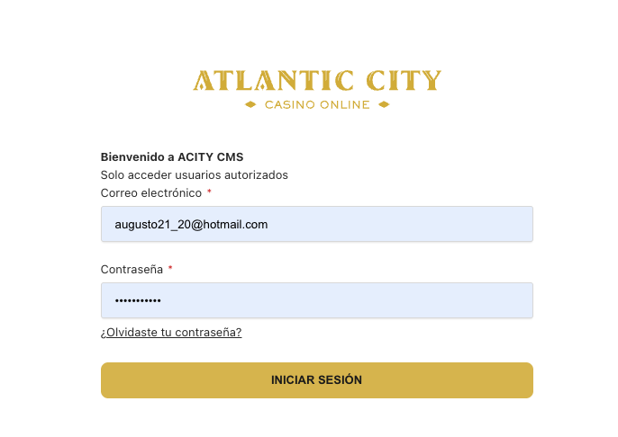

# 2. Acceso al CMS:

- **URL de acceso**: https://cms-dx.acity.com.pe/admin/login

- **Credenciales**:

  - Correo electrónico: proporcionado por el administrador (Ejemplo: `admin@acity.com.pe`)

  - Contraseña: proporcionada por el administrador (Ejemplo: `12345`)

- **Recomendación**: Usar Google Chrome para una mejor compatibilidad.

**Pantalla de login**:

En esta pantalla deberás ingresar tu correo electrónico y contraseña asignada. También encontrarás un enlace para recuperar tu contraseña en caso la hayas olvidado, y un botón para **iniciar sesión**. Asegúrate de que los datos ingresados sean correctos para acceder al panel principal del CMS.
