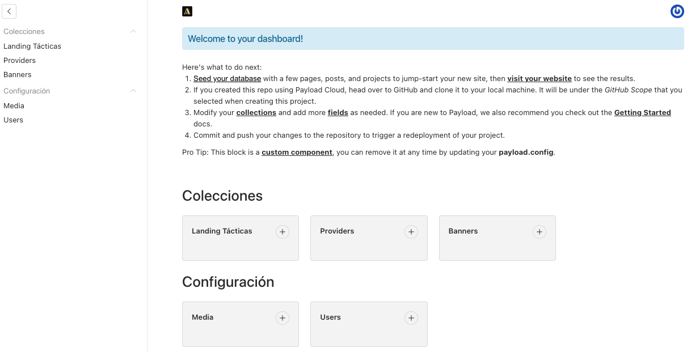

# 3. Pantalla Principal del CMS:

Una vez que inicias sesión, verás el **Dashboard principal**, donde se muestran las principales secciones del CMS:

- **Landing Tácticas**:
  Es la colección donde se crean, editan y administran las promociones. Cada entrada genera un JSON con los datos configurados, que se usarán en la landing correspondiente.

- **Configuración**:
  Contiene submódulos como:

      - **Media**: para subir y administrar imágenes (como logos, portadas o banners).

      - **Users**: gestión de los usuarios que tienen acceso al CMS.

Desde este panel puedes navegar fácilmente entre las secciones y comenzar a trabajar en las campañas promocionales.
