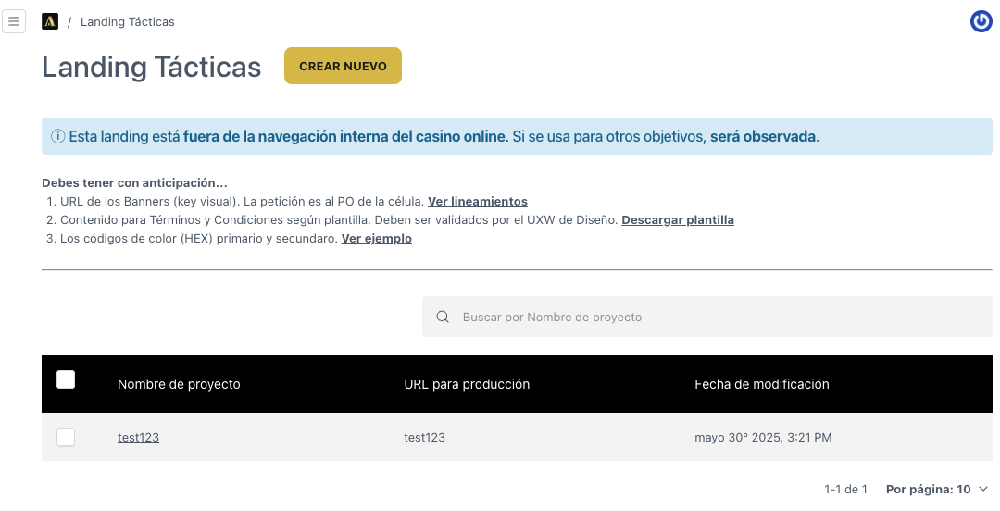
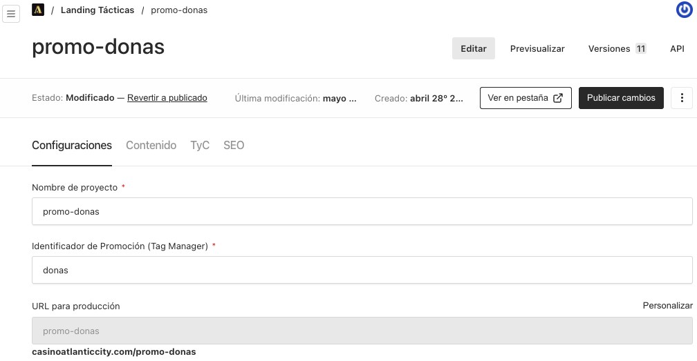
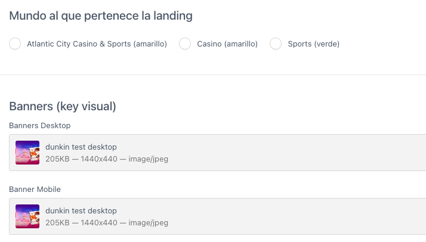
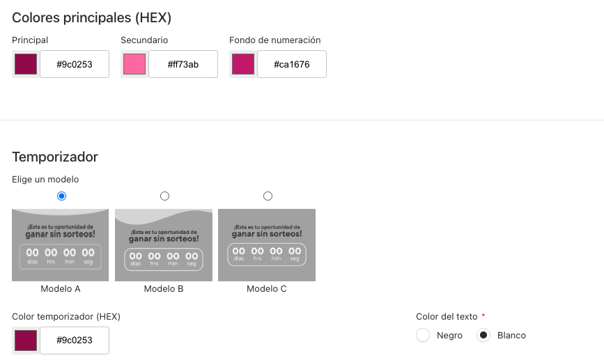

# 4. Crear una Nueva Promoción:

1. **Antes de crear una nueva landing**, asegúrate de revisar las recomendaciones ubicadas en la parte superior de la tabla de promociones. Estas contienen requisitos importantes que debes tener a la mano para completar correctamente la configuración de la campaña.

2. Presionar el botón **“Crear Nuevo”** ubicado en la parte superior derecha.

En esta vista también encontrarás una tabla resumen de las landings creadas con las siguientes columnas:

- **Nombre de proyecto**
- **URL para producción**
- **Fecha de modificación**

<li class='list-none'>
3. Al darle <strong>Crear Nuevo</strong> se visualizará los siguientes campos:
</li>

---

<li class='list-none' style="margin-left: 20px">
3.1 Visualizaremos otros campos:
</li>

---

<li class='list-none' style="margin-left: 20px">
3.2 Observaremos los colores principales y modelos del Temporizador (Brindados por UI).
</li>

---

<li class='list-none'>
4. Tenemos las siguientes opciones:
</li>

Donde contamos con 4 Tabs que a su vez contiene los siguientes campos:

- **Configuraciones**:

      - Nombre de campaña

      - Identificador de Promoción (Tag Manager)
      - URL para producción
      - Mundo al que pertenece la landing (casino atlantic city, casino, sports)
      - Banners (key visual)
      - Colores principales (Hexadecimal)
      - Temporizador (modelo, color de fondo, color de texto)

- **Contenido**:

      - ¿Qué incluye el premio/paquete? (Descripción)
      - Pasos para participar en la promoción
      - Botón principal (Texto y donde te lleva)

- **TyC (Términos y Condiciones)**:

      - Vigencia (Fecha de inicio y fin)
      - Mecánica
      - Premio

- **SEO (Optimización para Motores de Búsqueda)**:

      - Título
      - Meta Image
      - Descripción
