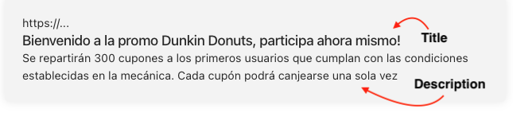
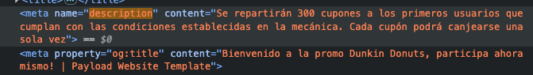

_Al completar correctamente los campos del SEO, podremos visualizar que funciona correctamente de las siguientes maneras:_

- **En el mismo CMS:**

- **Abriendo en Previsualizar (con ícono)**

  Damos clic en **Previsualizar** donde se abrirá otra pestaña donde se podrá visualizar la landing con los datos completos.

Podremos visualizar la landing de la siguiente manera:

Realizaremos los siguientes pasos con la landing que visualizamos en una nueva pestaña.

1. Clic derecho
2. Inspeccionar
3. Seleccionan Elementos:
4. `Ctrl o Cmd + f` y escriben **description**, les mostará:

Observaremos que se muestra los valores de los campos title y description que se agregaron en el CMS:

Usando una extensión "OGraph Previewer 2.0.0"

- Activamos la extensión
- Clic al ícono de la extensión y observaremos que se registró correctamente los campos (Title, Image, Description):

