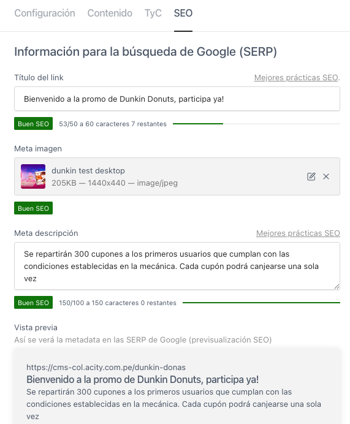

- **Title:** Campo destinado a establecer un título claro y conciso que resuma el contenido principal de la promoción. Este texto será utilizado por los motores de búsqueda (como Google) para mostrar el nombre de la página en los resultados. Se recomienda no superar los 60 caracteres. **Ejemplo de uso:** `Bienvenido a la promo Dunkin Donuts, participa ahora mismo!`

- **Meta Image:** Imagen representativa de la promoción que se muestra cuando el enlace es compartido en redes sociales o aplicaciones de mensajería (como WhatsApp o Facebook). La imagen debe captar la atención y estar relacionada con la temática de la promoción. **Recomendación:** Usar imágenes en formato horizontal (ej. 1200x630 px), con poco texto y de buena calidad. **Ejemplo de uso:** `Se repartirán 300 cupones a los primeros usuarios que cumplan con las condiciones establecidas en la mecánica. Cada cupón podrá canjearse una sola vez`

- **Description:** Resumen breve del contenido de la promoción que será visible en los resultados de búsqueda. Sirve para informar y atraer al usuario. Debe incluir los aspectos clave como premios, condiciones y fechas. El texto no debe exceder los 200 caracteres para evitar cortes en los buscadores.
