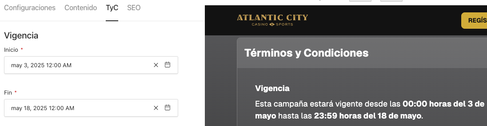
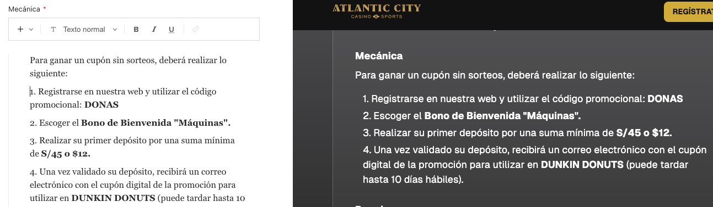
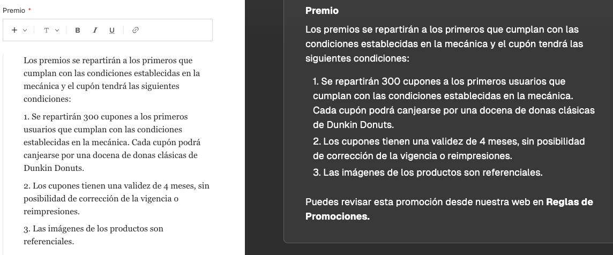

En esta tab podremos visualizar los diferentes campos como: Vigencia, Mecánica, Premio:

- **Vigencia:** Permite definir el período de duración de la promoción mediante dos campos de fecha: **Inicio y Fin (\*)**. Esta información se mostrará dentro de la sección de Términos y Condiciones. **Estos campos son obligatorios.**

---

- **Mecánica:** Describe detalladamente los pasos que debe seguir el usuario para participar. Puedes incluir títulos, subtítulos, párrafos de texto y listas numeradas o con viñetas.

---

- **Premio:** Detalla lo que recibirán los participantes que cumplan con las condiciones. Incluye cantidad de premios, condiciones de uso, vigencia del cupón y cualquier otra restricción relevante. También puedes incluir títulos, subtítulos, párrafos de texto y listas numeradas o con viñetas.

El resultado final será un componente con todos los datos completados (Vigencia, Mecánica y Premio). Ejemplo: [TyC de Landing Táctica Dunkin Donuts](https://www.casinoatlanticcity.com/promociones-donas)
